# Ubuntu User and Permissions Lab

## Project Overview

This project demonstrates basic Linux user, group, and file permission management using Ubuntu in a VirtualBox environment. The goal of the lab was to simulate a small company file access structure where each department has its own folder and only authorized users can access their assigned department directory.

The lab includes creating local Linux users, department groups, shared folders, assigning group ownership, configuring permissions with `chmod`, and testing access restrictions.

## Tools Used

- Oracle VirtualBox
- Ubuntu Linux
- Linux Terminal
- Linux users and groups
- `chown`
- `chmod`
- `ls -l`
- `su`

## Lab Objectives

- Install and configure an Ubuntu virtual machine
- Create department folders for IT, HR, and Management
- Create Linux groups for each department
- Create local users for each department
- Assign users to the correct department groups
- Configure group ownership for department folders
- Apply Linux permissions to restrict unauthorized access
- Test successful and denied access for each user

---

## 1. Ubuntu Virtual Machine Setup

Ubuntu was installed and configured inside Oracle VirtualBox for this lab environment.

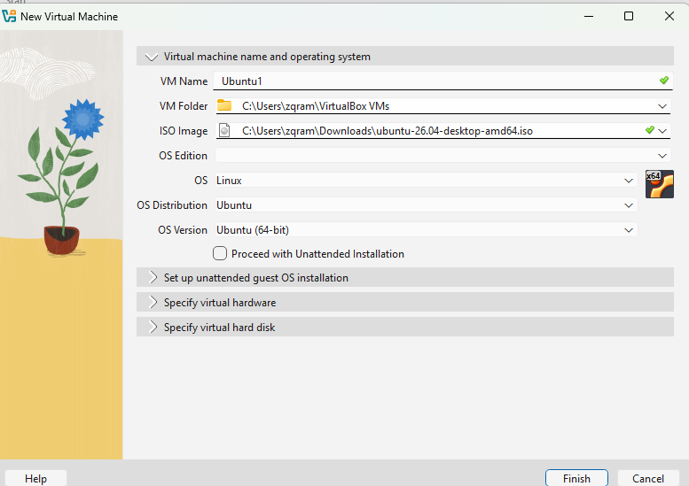

After installation, the Ubuntu desktop environment was successfully loaded.

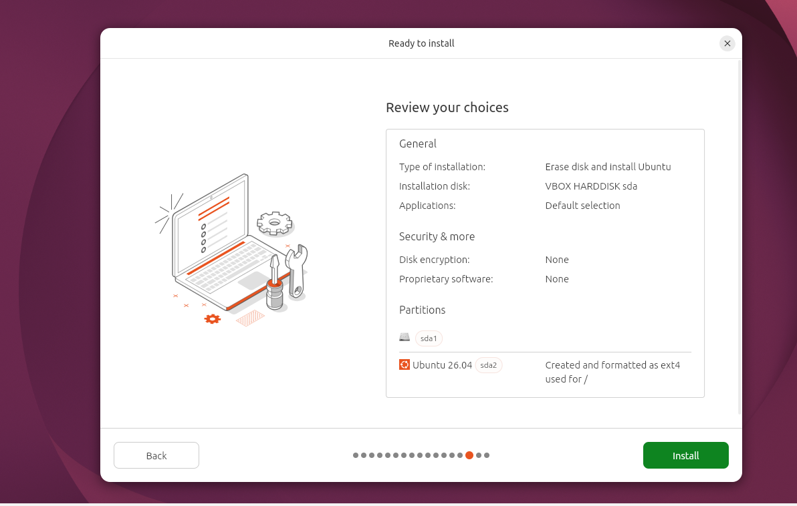


The main administrator account was verified using basic Linux commands.

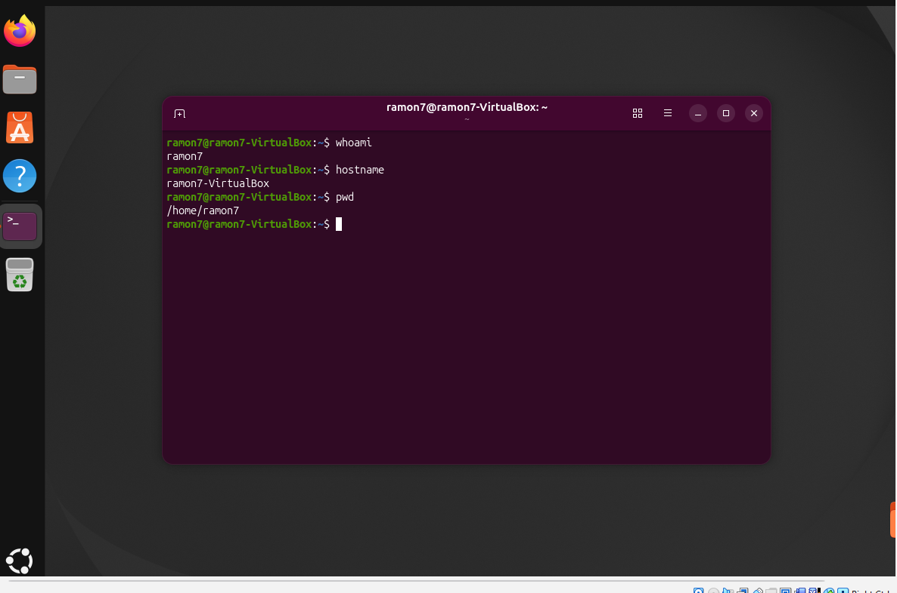

---

## 2. Company Folder Structure

A company directory was created under `/company`, with separate folders for each department:

- `/company/IT`
- `/company/HR`
- `/company/Management`

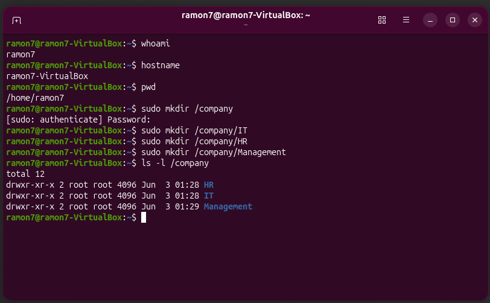

---

## 3. Department Groups Created

Three Linux groups were created to represent company departments:

- `it`
- `hr`
- `management`

These groups were verified using the `getent group` command.

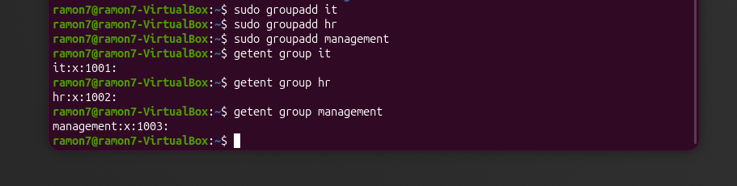

---

## 4. Department Users Created

Three local Linux users were created:

- `ituser`
- `hruser`
- `manageruser`

Each user represents an employee from a different department.

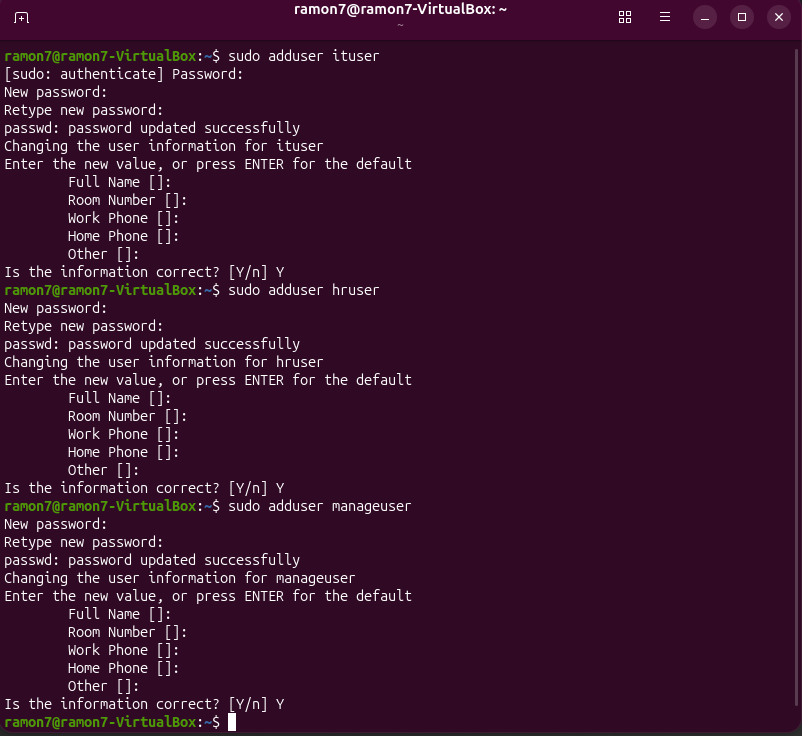

---

## 5. Users Assigned to Department Groups

Each user was assigned to the correct department group:

- `ituser` was assigned to the `it` group
- `hruser` was assigned to the `hr` group
- `manageruser` was assigned to the `management` group

The `groups` command was used to verify each user's group membership.

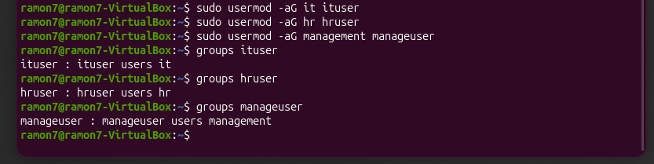

---

## 6. Folder Ownership Assigned to Correct Groups

Each department folder was assigned to its matching group using the `chown` command:

- `/company/IT` was assigned to the `it` group
- `/company/HR` was assigned to the `hr` group
- `/company/Management` was assigned to the `management` group

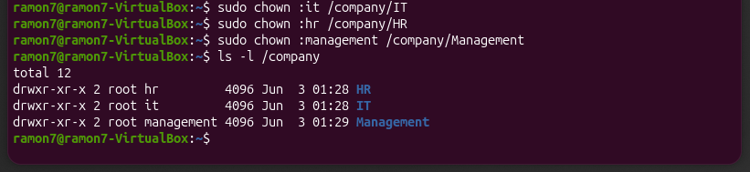

---

## 7. Folder Permissions Configured

The `chmod 770` command was applied to each department folder.

This permission setting allows:

- Owner: read, write, and execute
- Group: read, write, and execute
- Others: no access

This prevents users outside the assigned department group from accessing the folder.

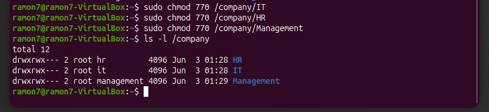

---

## 8. IT User Access Test

The `ituser` account was able to access the IT folder successfully.

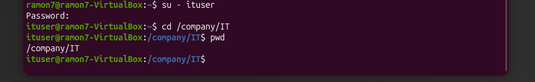

The same user was denied access to the HR and Management folders.

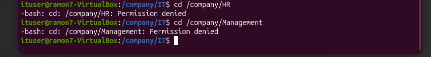

---

## 9. HR User Access Test

The `hruser` account was able to access the HR folder successfully but was denied access to the IT and Management folders.

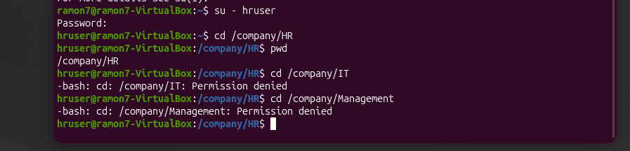

---

## 10. Management User Access Test

The `manageruser` account was able to access the Management folder successfully but was denied access to the IT and HR folders.

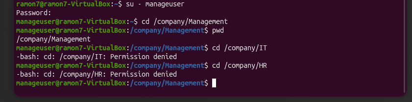

---

## 11. Final Permissions Verification

The final folder permissions were verified using:

```bash
ls -l /company
```

The output confirmed that each department folder was assigned to the correct group and configured with restricted permissions.

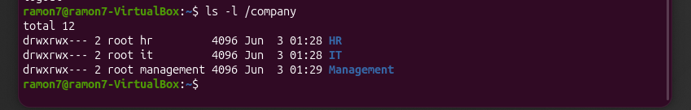

---

## Skills Demonstrated

- Ubuntu Linux installation in VirtualBox
- Linux user account creation
- Linux group management
- File and directory permissions
- Group-based access control
- `chown` and `chmod` usage
- Terminal-based system administration
- Access testing and verification
- Technical documentation

## Summary

This lab demonstrates how Linux users, groups, and permissions can be used to control access to shared department folders. By assigning users to specific groups and applying folder permissions, the system was configured so each department user could only access their authorized directory.

This project helped reinforce basic Linux administration concepts related to user management, group membership, folder ownership, and permission-based access control.
